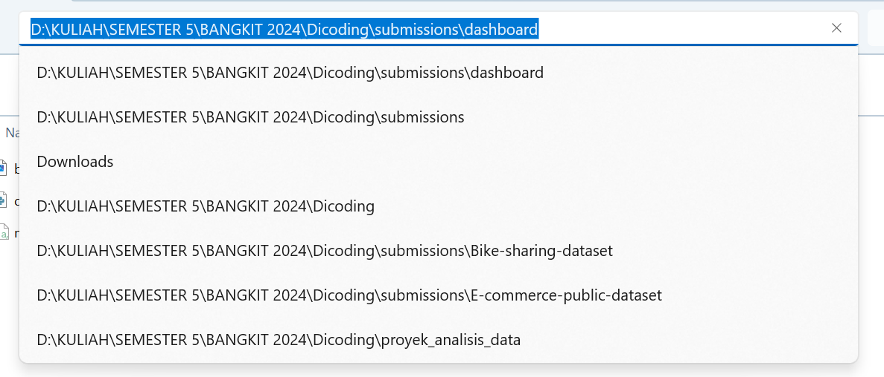
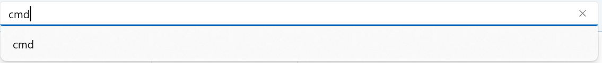
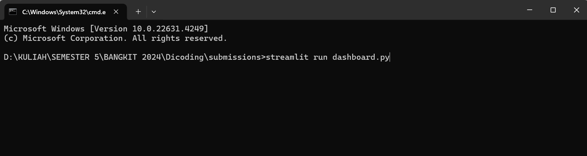
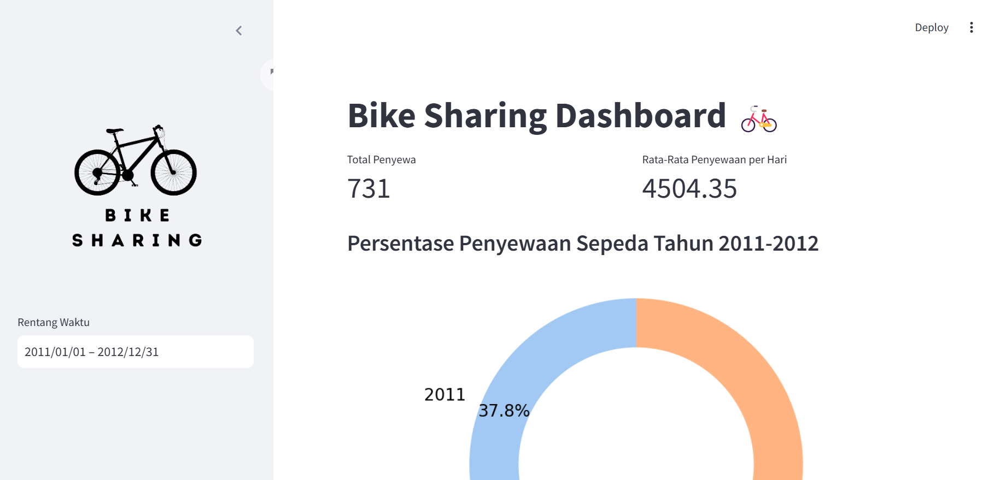

# Sumission Bike Sharing Dashboard 🚲

---

### Setup Environment - Shell/Terminal

---

#### 1. Install library berikut ini! 

pip install pandas matplotlib seaborn streamlit pipreqs

#### 2. Masuk ke path tempat file requirements.txt akan disimpan

- cd /path/to/the/project
  * ex: cd /d "D:\KULIAH\SEMESTER 5\BANGKIT 2024\Dicoding\submission"

- gunakan command "pipreqs ." untuk membuat requirements.txt

### Run Streamlit App from Local

---

1. Buka direktori tempat file dashboard.py disimpan dengan cara seperti gambar dibawah ini

Ketik "cmd" kemudian enter

2. Setelah muncul command prompt ketik command "streamlit run dashboard.py" kemudian enter seperti pada gambar dibawah ini

3. Dashboard akan terbuka di browser dan tampilan akan berubah menjadi dashboard bike sharing

